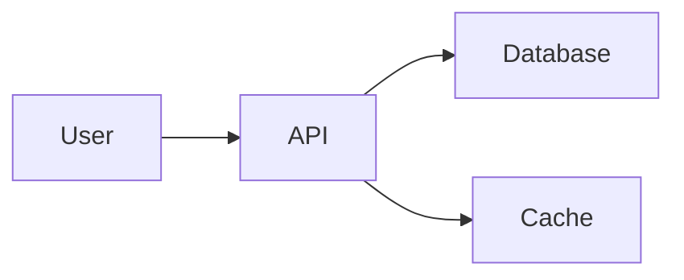
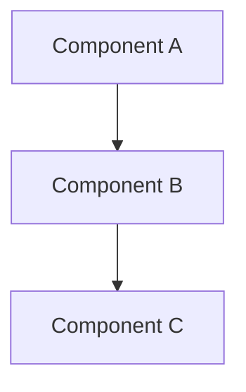
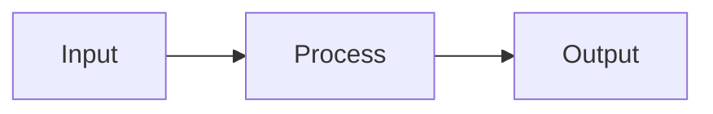
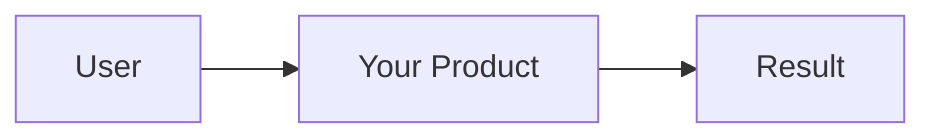

# LLM Guide to Creating MarkDeck Presentations

This guide is specifically designed for Large Language Models (LLMs) and AI assistants like Claude Code to help create effective, well-structured MarkDeck presentations.

## Table of Contents

1. [Quick Start for LLMs](#quick-start-for-llms)
2. [Presentation Structure Best Practices](#presentation-structure-best-practices)
3. [Content Guidelines](#content-guidelines)
4. [Feature Usage](#feature-usage)
5. [Common Patterns](#common-patterns)
6. [Templates](#templates)
7. [Prompt Examples](#prompt-examples)

---

## Quick Start for LLMs

### Basic Presentation Format

```markdown
# Title Slide

Subtitle or brief description

---

## Content Slide

- Point 1
- Point 2
- Point 3

---

## Next Slide

More content here
```

### Essential Rules

1. **Slide Delimiter**: Use `---` on its own line with blank lines before and after
2. **First Slide**: Typically a title slide with `#` heading
3. **Keep It Concise**: 3-5 bullet points per slide maximum
4. **Use Headings**: Each slide should have a clear `##` heading (except title slide which uses `#`)
5. **Visual Hierarchy**: Use heading levels appropriately (don't skip levels)

---

## Presentation Structure Best Practices

### Recommended Flow

```markdown
# [Title]
Subtitle or tagline

---

## Overview / Agenda
- Topic 1
- Topic 2
- Topic 3

---

## [Topic 1]
Main content...

---

## [Topic 2]
Main content...

---

## [Topic 3]
Main content...

---

## Summary / Key Takeaways
- Recap point 1
- Recap point 2
- Recap point 3

---

## Thank You / Questions
Contact information or next steps
```

### Slide Count Guidelines

| Presentation Length | Recommended Slides |
|---------------------|-------------------|
| Lightning talk (5 min) | 5-10 slides |
| Standard talk (15 min) | 12-20 slides |
| Detailed talk (30 min) | 20-35 slides |
| Workshop (60 min) | 30-50 slides |

**Rule of thumb**: ~1-2 minutes per slide for talks, ~1.5-2.5 minutes for workshops

---

## Content Guidelines

### Text Content

**DO:**
- ✅ Keep bullet points short (5-10 words max)
- ✅ Use 3-5 bullets per slide
- ✅ Use bold for **key terms** and *italic* for emphasis
- ✅ Break complex topics into multiple slides
- ✅ Use active voice
- ✅ Include examples and analogies

**DON'T:**
- ❌ Put paragraphs of text on slides
- ❌ Use more than 7 bullets on a slide
- ❌ Make every bullet a full sentence
- ❌ Use jargon without explanation
- ❌ Cram too much information on one slide

### Code Blocks

**Best Practices:**

1. **Keep code concise** - 15-20 lines maximum per slide
2. **Use syntax highlighting** - Always specify the language
3. **Add comments** - Explain complex parts
4. **Focus** - Show only relevant code, use `...` to indicate omitted parts
5. **Consider two-column layout** - Code on left, explanation on right

**Good Example:**

````markdown
## Function Example

```python
def fibonacci(n: int) -> int:
    """Calculate the nth Fibonacci number."""
    if n <= 1:
        return n
    return fibonacci(n - 1) + fibonacci(n - 2)
```

Simple recursive implementation - easy to understand but not optimized.
````

**For Long Code:**

````markdown
## Complete Implementation

:::columns
```python
# Left: Implementation
def process_data(items):
    results = []
    for item in items:
        if validate(item):
            results.append(
                transform(item)
            )
    return results
```

|||

### Explanation

1. **Validate** each item
2. **Transform** valid items
3. **Return** results list

Simple pipeline pattern
:::
````

### Visual Elements

#### When to Use Tables

```markdown
## Comparison

| Feature | Option A | Option B |
|---------|----------|----------|
| Speed | Fast | Slow |
| Cost | High | Low |
| Ease | Medium | Easy |
```

**Use tables for:**
- Comparisons between 2-4 items
- Feature matrices
- Specifications
- Results/data

**Keep tables:**
- Under 6 rows
- Under 5 columns
- Simple (no nested structures)

#### When to Use Mermaid Diagrams

```markdown
## Architecture


```

**Use Mermaid for:**
- System architecture
- Workflows and processes
- Data flows
- State machines
- Relationships

**Types available:**
- `graph` / `flowchart` - Flowcharts
- `sequenceDiagram` - Sequence diagrams
- `classDiagram` - Class relationships
- `stateDiagram-v2` - State machines
- `gitGraph` - Git workflows
- `pie` - Pie charts

#### When to Use Math Equations

```markdown
## Key Formula

The famous equation: $E = mc^2$

Or display format:

$$\sum_{i=1}^{n} i = \frac{n(n+1)}{2}$$
```

**Use for:**
- Mathematical concepts
- Algorithms (Big O notation)
- Statistical formulas
- Physical equations

### Images

```markdown
## Visual Example


- Clear and simple
- High contrast
- Relevant to topic
```

**Best Practices:**
- Use relative paths (`./images/diagram.png`)
- Keep images simple and high-contrast
- Add descriptive alt text
- Ensure images are sized appropriately (ideally 800-1200px wide)

---

## Feature Usage

### Speaker Notes

**When to Add:**
- Complex slides needing explanation
- Statistics or data that need context
- Timing reminders
- Additional details not on slide
- Talking points

**How to Add:**

```markdown
## Main Slide Content

Visible points here

<!--NOTES:
- Expand on point 1 with example
- Remember to mention the 2023 study
- Timing: 2 minutes on this slide
- Transition: Ask audience about their experience
-->
```

**Best Practice:**
- Add notes to every slide for complex presentations
- Include timing estimates
- Note transitions between slides
- Mention audience interaction points

### Two-Column Layouts

**When to Use:**

1. **Code + Explanation** (Most common)
2. **Before/After comparisons**
3. **Pros vs Cons**
4. **Problem vs Solution**
5. **Concept vs Example**

**Syntax:**

```markdown
:::columns
Left content here

|||

Right content here
:::
```

**Examples:**

````markdown
## Pattern 1: Code + Explanation

:::columns
### Implementation

```python
@decorator
def function(arg):
    return process(arg)
```

|||

### How It Works

- `@decorator` modifies function
- Takes single argument
- Returns processed result
:::

---

## Pattern 2: Comparison

:::columns
### Traditional Approach

- Step 1: Manual setup
- Step 2: Configuration
- Step 3: Testing
- Time: Hours

|||

### Modern Approach

- Step 1: Automated setup
- Step 2: Auto-config
- Time: Minutes
:::

---

## Pattern 3: Problem/Solution

:::columns
### The Problem

Large monolithic applications:
- Hard to maintain
- Slow deployment
- Scaling issues

|||

### The Solution

Microservices architecture:
- Independent services
- Fast deployment
- Easy to scale
:::
````

### Grid View Feature

**For Presenters:**
- Press `O` to see all slides
- Useful for navigation during Q&A
- Helps find specific slides quickly

**When Creating Presentations:**
- Make sure slide titles are distinctive
- First line of content should be meaningful
- Consider adding visual variety (code, diagrams, text)

### Themes

**Available Themes:**
- Dark (default)
- Light
- Beige

**For LLMs:**
- Don't need to specify theme in markdown
- User can cycle with `T` key
- Content should work well in all themes

---

## Common Patterns

### Pattern 1: Technical Concept Introduction

```markdown
## [Concept Name]

**Definition**: Brief one-sentence definition

**Key Points:**
- Point 1
- Point 2
- Point 3

**Example**: Simple example or analogy
```

### Pattern 2: Code Example Slide

````markdown
## [What the Code Does]

```language
# Concise, focused code
def example():
    pass
```

**Key aspects:**
- What it does
- Why it's useful
- When to use it
````

### Pattern 3: Process/Workflow Slide

```markdown
## [Process Name]

1. **Step 1**: Brief description
2. **Step 2**: Brief description
3. **Step 3**: Brief description

**Result**: What you achieve
```

### Pattern 4: Architecture/Diagram Slide

````markdown
## System Architecture



**Key Components:**
- Component A: Purpose
- Component B: Purpose
- Component C: Purpose
````

### Pattern 5: Takeaways/Summary Slide

```markdown
## Key Takeaways

**Remember:**
- ✓ Main point 1
- ✓ Main point 2
- ✓ Main point 3

**Next Steps:**
- Action item 1
- Action item 2
```

---

## Templates

### Template 1: Technical Talk (15-20 min)

```markdown
# [Talk Title]

[Your Name]
[Event/Date]

---

## Agenda

- Background
- The Problem
- Our Solution
- Demo
- Results
- Q&A

---

## Background

- Context point 1
- Context point 2
- Why this matters

---

## The Problem

- Problem description
- Impact
- Current solutions (and why they fall short)

---

## Our Solution

:::columns
### Approach

- Key aspect 1
- Key aspect 2
- Key aspect 3

|||

### Benefits

- Benefit 1
- Benefit 2
- Benefit 3
:::

---

## Architecture



---

## Code Example

```python
# Key implementation detail
def solution():
    pass
```

---

## Demo

[Demo slide - keep minimal, focus on live demo]

Key points to show:
- Feature 1
- Feature 2
- Feature 3

---

## Results

| Metric | Before | After | Improvement |
|--------|--------|-------|-------------|
| Speed | 100ms | 10ms | 10x |
| Cost | $100 | $10 | 90% |

---

## Key Takeaways

- ✓ Problem X is solved with approach Y
- ✓ Benefits include A, B, C
- ✓ Ready to use today

---

## Thank You!

**Questions?**

Contact: [email/website]
Code: [github link]
```

### Template 2: Tutorial/Workshop (30-60 min)

```markdown
# [Tutorial Title]

Learn [skill/technology] in [time]

---

## What We'll Cover

1. Prerequisites
2. Setup
3. Basics
4. Hands-on Exercise 1
5. Advanced Topics
6. Hands-on Exercise 2
7. Best Practices
8. Resources

---

## Prerequisites

**You should know:**
- Prerequisite 1
- Prerequisite 2

**You'll need:**
- Tool 1
- Tool 2

---

## Setup

Step-by-step setup:

1. Install X
2. Configure Y
3. Verify with Z

```bash
# Quick setup commands
command1
command2
```

---

## Basics: Concept 1

:::columns
### Code

```python
# Simple example
code here
```

|||

### Explanation

- What it does
- How it works
- Why it matters
:::

---

## Exercise 1: [Name]

**Goal**: [What you'll build]

**Steps:**
1. Step 1
2. Step 2
3. Step 3

**Time**: 5-10 minutes

<!--NOTES:
- Walk around and help
- Common issues: X, Y
- Solution available in repo
-->

---

## Advanced Topics

More complex patterns:
- Pattern 1
- Pattern 2
- Pattern 3

[Continue with code examples...]

---

## Best Practices

**Do:**
- ✓ Best practice 1
- ✓ Best practice 2

**Avoid:**
- ✗ Common mistake 1
- ✗ Common mistake 2

---

## Resources

**Documentation:**
- [Official docs](url)

**Code:**
- [GitHub repo](url)

**Community:**
- [Forum/Discord](url)

---

## Thank You!

**Questions?**

Slides and code: [link]
```

### Template 3: Product/Feature Demo

```markdown
# [Product Name]

[Tagline]

---

## The Problem

[Paint the picture of the problem]

**Pain points:**
- Pain 1
- Pain 2
- Pain 3

---

## Introducing [Product]

[One-sentence value proposition]

**How it helps:**
- Benefit 1
- Benefit 2
- Benefit 3

---

## How It Works



Simple, fast, effective

---

## Feature 1: [Name]

[Screenshot or demo]

**Key capabilities:**
- Capability 1
- Capability 2

---

## Feature 2: [Name]

[Screenshot or demo]

**Why it matters:**
- Reason 1
- Reason 2

---

## Real Results

| Customer | Problem | Result |
|----------|---------|--------|
| Company A | Issue X | 50% improvement |
| Company B | Issue Y | 3x faster |

---

## Pricing

| Plan | Features | Price |
|------|----------|-------|
| Free | Basic | $0 |
| Pro | Advanced | $X |
| Enterprise | Full | Contact |

---

## Get Started

1. Sign up at [url]
2. Follow quick start guide
3. Deploy in minutes

**Try it free:** [link]

---

## Thank You!

**Questions?**

Website: [url]
Demo: [link]
Contact: [email]
```

---

## Prompt Examples

### For LLMs Creating Presentations

When asking an LLM to create a presentation, provide:

1. **Topic and Audience**
   ```
   Create a MarkDeck presentation about Python async/await for
   intermediate developers who know basic Python but not async.
   ```

2. **Duration and Depth**
   ```
   15-minute technical talk, should include code examples and diagrams.
   ```

3. **Key Points to Cover**
   ```
   Must cover: what async is, when to use it, basic syntax,
   common patterns, and pitfalls to avoid.
   ```

4. **Special Requirements**
   ```
   Include speaker notes, use two-column layouts for code examples,
   add a mermaid diagram showing async flow.
   ```

### Complete Prompt Example

```
Create a MarkDeck presentation for me:

Topic: Introduction to Docker for Python developers
Audience: Python developers new to containers
Duration: 20 minutes
Format: Technical talk

Must include:
- What Docker is and why it matters
- Key concepts (images, containers, Dockerfile)
- Python-specific examples
- A simple Dockerfile example
- Best practices
- Common pitfalls

Requirements:
- Use two-column layouts for code + explanations
- Include a mermaid diagram showing container architecture
- Add speaker notes for complex slides
- Include a hands-on exercise
- End with resources and next steps

Style: Professional but approachable, use analogies for complex concepts
```

### Iteration Prompt Example

```
Please improve the presentation by:
- Adding more code examples to slides 5-7
- Creating a comparison table of Docker vs VMs
- Adding speaker notes to the architecture slides
- Breaking slide 10 into two slides (too much content)
- Adding a mermaid sequence diagram showing container startup
```

---

## Tips for LLMs

### Content Creation Workflow

1. **Understand the request** - Parse topic, audience, duration, requirements
2. **Create outline** - Structure with clear sections
3. **Estimate slides** - Aim for 1-2 min per slide
4. **Develop content** - Start with key slides, then supporting content
5. **Add features** - Code blocks, diagrams, two-columns where appropriate
6. **Add speaker notes** - For complex or time-sensitive slides
7. **Review flow** - Ensure logical progression
8. **Polish** - Check formatting, consistency

### Common Mistakes to Avoid

1. ❌ **Too much text** - Keep bullets concise
2. ❌ **No clear structure** - Always have intro, body, conclusion
3. ❌ **Inconsistent heading levels** - Use `#` for title, `##` for all other slides
4. ❌ **Missing slide delimiters** - Always use `---` with blank lines
5. ❌ **Code without language** - Always specify language for syntax highlighting
6. ❌ **Complex diagrams** - Keep mermaid diagrams simple
7. ❌ **Forgotten speaker notes** - Add for technical presentations
8. ❌ **No examples** - Abstract concepts need concrete examples

### Quality Checklist

Before delivering a presentation, verify:

- [ ] Title slide with clear topic
- [ ] Overview/agenda slide (for talks >10 min)
- [ ] Logical flow between slides
- [ ] Consistent heading structure
- [ ] Code blocks have language specified
- [ ] Tables are simple and readable
- [ ] Mermaid diagrams render correctly (test if unsure)
- [ ] Two-column syntax is correct
- [ ] Speaker notes where needed
- [ ] Summary/takeaway slide
- [ ] Thank you/contact slide
- [ ] Proper slide delimiters (`---`)
- [ ] No slides with >7 bullet points
- [ ] No code blocks >25 lines
- [ ] Varied content (not all text or all code)

---

## Advanced Techniques

### Storytelling Structure

```markdown
# [Engaging Title]

Hook the audience

---

## The Journey

- Where we started (problem)
- What we discovered (solution)
- Where we are now (results)

---

## Act 1: The Challenge

[Set up the problem]

---

## Act 2: The Quest

[Show the journey to solution]

---

## Act 3: The Resolution

[Show the results and impact]

---

## Lessons Learned

What we'd do differently...
```

### Data Presentation

```markdown
## Results

:::columns
### The Data

| Metric | Value |
|--------|-------|
| Speed | 10x |
| Cost | -50% |

|||

### What It Means

**Impact:**
- Faster delivery
- Lower costs
- Happier users
:::
```

### Call-to-Action Slides

```markdown
## Try It Yourself

**3 Ways to Get Started:**

1. **Quick Start**: [30-second action]
2. **Tutorial**: [5-minute action]
3. **Deep Dive**: [30-minute action]

**Choose your path:** [link]
```

---

## Conclusion

**Remember:**
- Keep it simple and focused
- Use visual elements strategically
- Add speaker notes for context
- Test your markdown syntax
- Structure for clarity

**This guide covers:**
- ✓ Basic structure and syntax
- ✓ Content best practices
- ✓ Feature usage
- ✓ Common patterns
- ✓ Ready-to-use templates
- ✓ Prompt examples

Happy presenting with MarkDeck! 🎬
