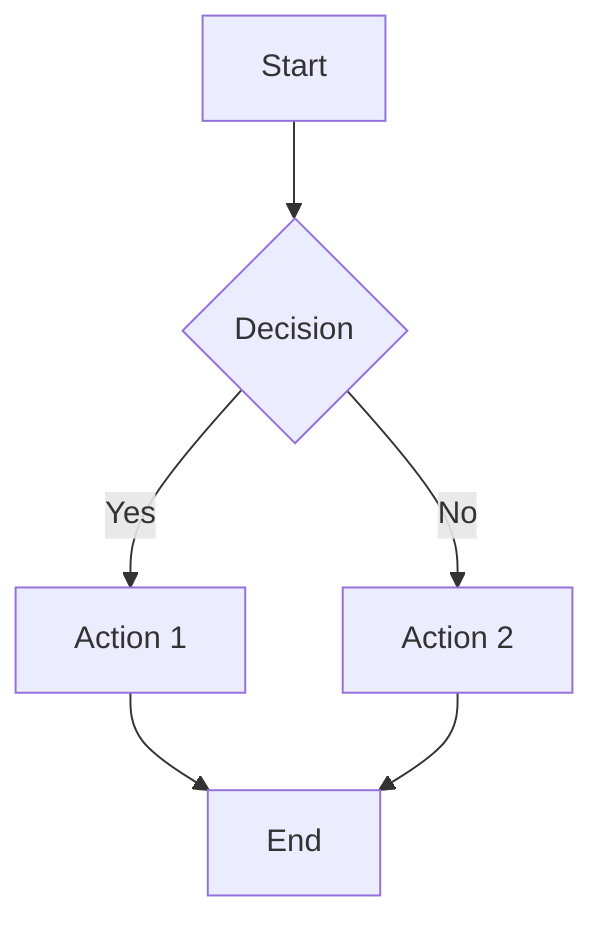
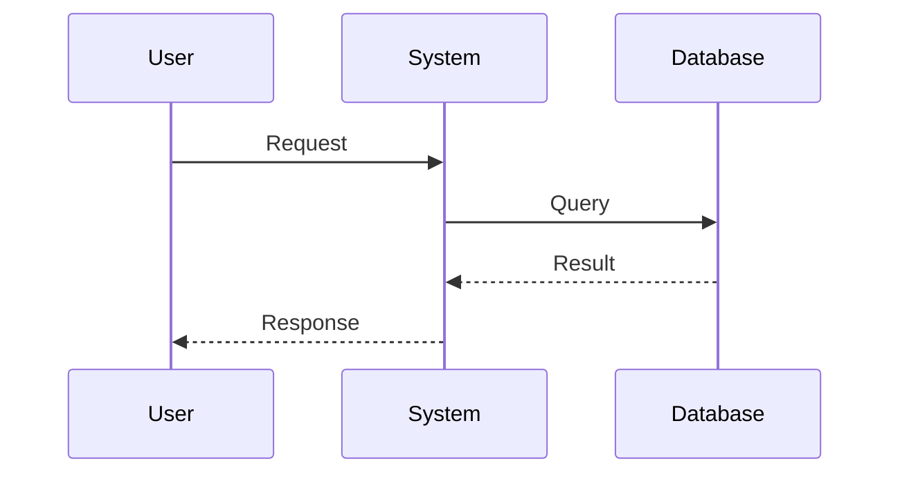
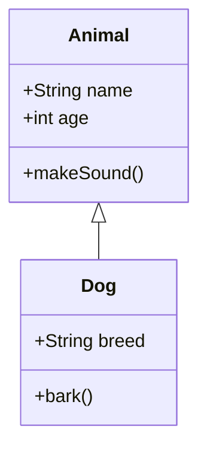
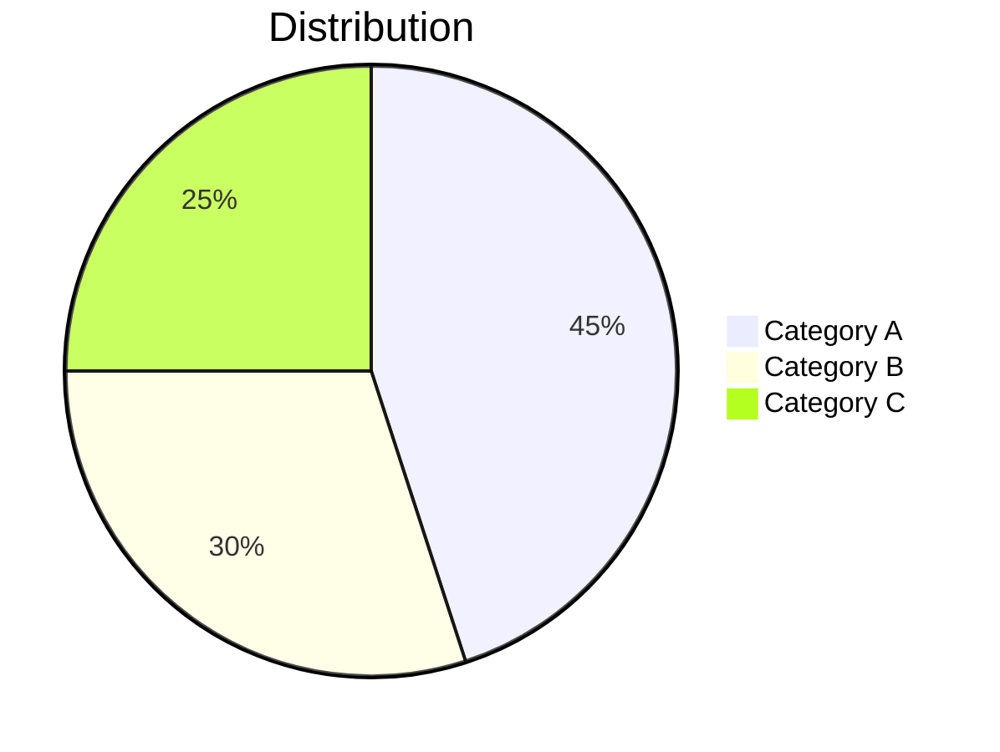
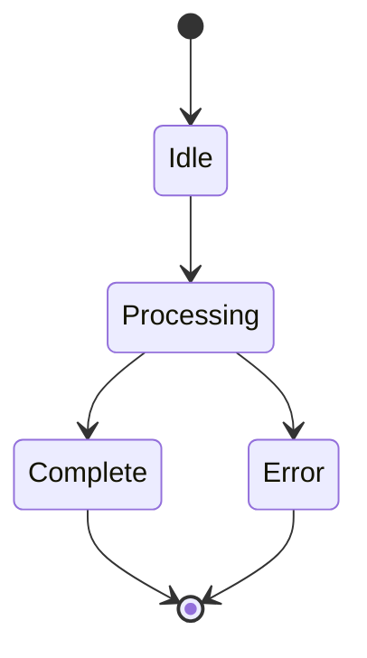
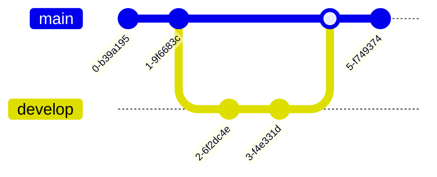
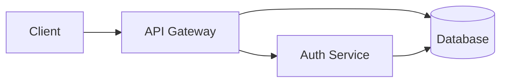

# MarkDeck Syntax Quick Reference

**For LLMs/Claude Code**: Use this as a quick copy-paste reference when creating presentations.

---

## Slide Delimiter

```markdown
# First Slide

Content here

---

## Second Slide

More content
```

**Rules:**
- `---` must be on its own line
- Blank line before and after `---`
- Cannot use `---` as horizontal rule within slides

---

## Headings

```markdown
# Title Slide (only use once - first slide)

---

## Regular Slide Heading (use for all other slides)

### Subheading

#### Smaller Subheading
```

**Best Practice:** Title slide uses `#`, all other slides use `##`

---

## Text Formatting

```markdown
**bold text**
*italic text*
***bold and italic***
~~strikethrough~~
`inline code`
```

**Result:**
- **bold text**
- *italic text*
- ***bold and italic***
- ~~strikethrough~~
- `inline code`

---

## Lists

### Unordered Lists

```markdown
- Item 1
- Item 2
  - Nested item 2a
  - Nested item 2b
- Item 3
```

**Also works:** `*` or `+` instead of `-`

### Ordered Lists

```markdown
1. First item
2. Second item
   1. Nested item
   2. Another nested item
3. Third item
```

---

## Links

```markdown
[Link text](https://example.com)
[Link with title](https://example.com "Tooltip text")
```

---

## Images

```markdown


```

**Best Practice:** Use relative paths for local images

---

## Code Blocks

### Inline Code

```markdown
Use `inline code` for short code snippets.
```

### Fenced Code Blocks

````markdown
```python
def hello():
    print("Hello, MarkDeck!")
```
````

**Supported Languages:** python, javascript, typescript, rust, go, java, cpp, c, csharp, ruby, php, sql, bash, shell, json, yaml, html, css, markdown, and many more

### Code Without Highlighting

````markdown
```
Plain text
No highlighting
```
````

---

## Tables

```markdown
| Header 1 | Header 2 | Header 3 |
|----------|----------|----------|
| Cell 1   | Cell 2   | Cell 3   |
| Cell 4   | Cell 5   | Cell 6   |
```

### Alignment

```markdown
| Left | Center | Right |
|:-----|:------:|------:|
| L1   | C1     | R1    |
| L2   | C2     | R2    |
```

**Alignment:**
- `:---` = left
- `:---:` = center
- `---:` = right

---

## Blockquotes

```markdown
> Single line quote

> Multi-line quote
> continues here
> and here

> ## Quote with heading
> And with **formatting**
```

---

## Speaker Notes

```markdown
## Slide Content

Visible content here

<!--NOTES:
These notes only appear in the terminal when presenting.
Use for:
- Talking points
- Additional context
- Timing reminders
- Statistics and sources
-->
```

**Syntax:**
- Must start with `<!--NOTES:`
- Must end with `-->`
- Can span multiple lines
- Not visible in browser (only in terminal)

---

## Two-Column Layouts

```markdown
:::columns
Left column content here

Can include:
- Lists
- **Formatting**
- Code blocks

|||

Right column content here

Also supports:
- All markdown
- Images
- Tables
:::
```

### Common Pattern: Code + Explanation

````markdown
:::columns
### Code

```python
def example():
    return "result"
```

|||

### Explanation

- What it does
- How it works
- When to use
:::
````

### Pattern: Comparison

```markdown
:::columns
### Option A

- Pro 1
- Pro 2
- Con 1

|||

### Option B

- Pro 1
- Con 1
- Con 2
:::
```

**Rules:**
- Start with `:::columns`
- Separate columns with `|||` (exactly 3 pipes)
- End with `:::`
- Can use any markdown in columns
- Columns stack vertically on mobile

---

## Mermaid Diagrams

### Flowchart

````markdown

````

**Graph Directions:**
- `TD` = Top to Down
- `LR` = Left to Right
- `BT` = Bottom to Top
- `RL` = Right to Left

### Sequence Diagram

````markdown

````

**Arrow Types:**
- `->` = Solid line
- `-->` = Dotted line
- `->>` = Solid arrow
- `-->>` = Dotted arrow

### Class Diagram

````markdown

````

### Pie Chart

````markdown

````

### State Diagram

````markdown

````

### Git Graph

````markdown

````

---

## Math Equations (KaTeX)

### Inline Math

```markdown
The equation $E = mc^2$ is famous.
Simple math: $x + y = z$
```

### Display Math (Centered)

```markdown
$$
\int_{-\infty}^{\infty} e^{-x^2} dx = \sqrt{\pi}
$$

$$
\sum_{i=1}^{n} i = \frac{n(n+1)}{2}
$$
```

### Common Symbols

```markdown
$\alpha, \beta, \gamma$ - Greek letters
$\sqrt{x}$ - Square root
$x^2$ - Superscript
$x_i$ - Subscript
$\frac{a}{b}$ - Fraction
$\sum_{i=1}^{n}$ - Summation
$\int_a^b$ - Integral
$\leq, \geq$ - Inequalities
$\times, \div$ - Multiplication, division
$\infty$ - Infinity
```

---

## Complete Slide Examples

### Example 1: Title Slide

```markdown
# Building Scalable APIs

A Practical Guide

John Doe | Tech Conference 2024
```

### Example 2: Content Slide

```markdown
## Key Principles

**REST API Design:**

- Use HTTP methods correctly
- Return appropriate status codes
- Version your API
- Document everything

**Remember:** Consistency is key
```

### Example 3: Code Example

````markdown
## Simple Implementation

```python
from fastapi import FastAPI

app = FastAPI()

@app.get("/items/{item_id}")
async def read_item(item_id: int):
    return {"item_id": item_id}
```

**Key Points:**
- Async support built-in
- Type hints for validation
- Automatic documentation
````

### Example 4: Two-Column with Code

````markdown
## Pattern: Factory Method

:::columns
### Implementation

```python
class ShapeFactory:
    @staticmethod
    def create(type):
        if type == "circle":
            return Circle()
        elif type == "square":
            return Square()
```

|||

### When to Use

**Benefits:**
- Centralized creation
- Easy to extend
- Loose coupling

**Use cases:**
- Object creation logic
- Plugin systems
:::
````

### Example 5: Diagram Slide

````markdown
## Request Flow



**Components:**
- API Gateway: Entry point
- Auth Service: Authentication
- Database: Data storage
````

### Example 6: Table Slide

```markdown
## Performance Comparison

| Method | Speed | Memory | Complexity |
|--------|------:|-------:|-----------:|
| Method A | 100ms | 50MB | O(n) |
| Method B | 50ms | 100MB | O(n log n) |
| Method C | 25ms | 150MB | O(n²) |

**Recommendation:** Method B for best balance
```

### Example 7: Math Slide

```markdown
## Algorithm Complexity

**Big O Notation:**

- Constant: $O(1)$
- Logarithmic: $O(\log n)$
- Linear: $O(n)$
- Linearithmic: $O(n \log n)$
- Quadratic: $O(n^2)$

**Binary Search Example:**

$$
T(n) = T(\frac{n}{2}) + O(1) = O(\log n)
$$
```

### Example 8: With Speaker Notes

```markdown
## Complex Topic

**Main points:**
- Point 1: Brief explanation
- Point 2: Brief explanation
- Point 3: Brief explanation

<!--NOTES:
Point 1 details:
- Example from 2023 study
- Statistics: 45% improvement
- Story about Company X

Point 2 details:
- Mention alternative approaches
- Common mistakes to avoid

Timing: 3 minutes on this slide
Transition: Ask audience for their experience
-->
```

---

## Keyboard Shortcuts Reference

Include this slide in presentations for user reference:

```markdown
## Keyboard Shortcuts

| Key | Action |
|-----|--------|
| `→` / `Space` / `PageDown` | Next slide |
| `←` / `PageUp` | Previous slide |
| `Home` | First slide |
| `End` | Last slide |
| `O` | Toggle grid view |
| `T` | Cycle themes |
| `F` | Toggle fullscreen |
| `?` | Show help |
| `Esc` | Exit overlay/fullscreen |
```

---

## Common Patterns Cheat Sheet

### Pattern: Title Slide
```markdown
# [Title]

[Subtitle]

[Author] | [Event] | [Date]
```

### Pattern: Section Divider
```markdown
## [Section Name]

[Optional tagline or brief description]
```

### Pattern: Bullet Points
```markdown
## [Topic]

**Key Points:**
- Point 1 (short)
- Point 2 (short)
- Point 3 (short)
```

### Pattern: Code Example
````markdown
## [What It Does]

```language
code here
```

**Explanation:**
- What
- How
- Why
````

### Pattern: Comparison
```markdown
## [Topic] Comparison

| Feature | A | B |
|---------|---|---|
| Aspect 1 | X | Y |
| Aspect 2 | X | Y |
```

### Pattern: Process/Steps
```markdown
## [Process Name]

1. **First**: Description
2. **Second**: Description
3. **Third**: Description

**Result:** Outcome
```

### Pattern: Takeaway
```markdown
## Key Takeaways

**Remember:**
- ✓ Important point 1
- ✓ Important point 2
- ✓ Important point 3

**Action Items:**
- Next step 1
- Next step 2
```

---

## Gotchas and Common Mistakes

### ❌ WRONG

```markdown
# Slide 1
---
# Slide 2
```
*Missing blank lines around delimiter*

### ✅ CORRECT

```markdown
# Slide 1

---

# Slide 2
```

---

### ❌ WRONG

````markdown
```
code without language
```
````
*No syntax highlighting*

### ✅ CORRECT

````markdown
```python
# Code with language specified
```
````

---

### ❌ WRONG

```markdown
:::columns
Left
||
Right
:::
```
*Only 2 pipes in separator*

### ✅ CORRECT

```markdown
:::columns
Left
|||
Right
:::
```
*Exactly 3 pipes*

---

### ❌ WRONG

```markdown
<!--NOTES:
Notes here
<!-- This breaks it -->
-->
```
*Nested HTML comments*

### ✅ CORRECT

```markdown
<!--NOTES:
Notes here
(avoid nested comments)
-->
```

---

## Quick Start Template

Copy and customize:

```markdown
# [Your Title]

[Your Subtitle]

---

## Overview

- Topic 1
- Topic 2
- Topic 3

---

## Topic 1

Content here...

---

## Topic 2

Content here...

---

## Topic 3

Content here...

---

## Summary

**Key Takeaways:**
- Point 1
- Point 2
- Point 3

---

## Thank You!

**Questions?**

Contact: [your info]
```

---

## Advanced: Custom HTML (Use Sparingly)

MarkDeck supports inline HTML for special cases:

```markdown
## Custom Styling

<div style="color: #ff6b6b; font-size: 2em; text-align: center;">
  Important Message
</div>

<details>
<summary>Click to expand</summary>

Hidden content here...

</details>
```

**Note:** Use markdown features first; only use HTML when absolutely necessary.

---

**Quick Reference Complete!** 🎯

For detailed guidance, see `LLM_PRESENTATION_GUIDE.md`
