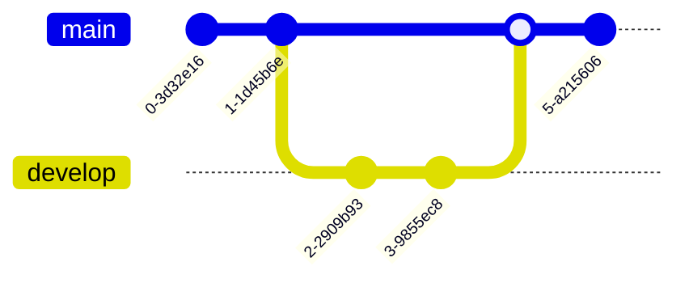

# MarkDeck Presentation Creator Skill

**Purpose:** Create professional MarkDeck presentations with proper syntax, structure, and best practices.

## What is MarkDeck?

MarkDeck is a lightweight, markdown-based presentation tool that runs locally. It features:
- Hot reload for live editing
- Grid view for slide navigation (press 'O')
- Multiple themes (dark/light/beige, press 'T')
- Syntax highlighting for code blocks
- Mermaid diagram support
- Math equations (KaTeX)
- Two-column layouts
- Speaker notes

**Installation:**
```bash
# Using uv (recommended)
uv pip install markdeck

# Using pip
pip install markdeck

# Run a presentation
markdeck present slides.md --watch
```

**Links:**
- PyPI: https://pypi.org/project/markdeck/
- GitHub: https://github.com/orangewise/markdeck

## Overview

This skill helps you create markdown-based presentations using MarkDeck. You'll guide users through creating slides with proper formatting, code examples, diagrams, and layouts.

## When to Use This Skill

Use this skill when users ask you to:
- Create a presentation or slideshow
- Make slides about a topic
- Generate a talk, workshop, or demo
- Convert content into presentation format
- Help with MarkDeck specifically

## Core Principles

1. **Always use proper slide delimiters**: `---` on its own line with blank lines before and after
2. **Specify language for code blocks**: Use ```python not just ```
3. **Keep slides concise**: 3-5 bullet points maximum per slide
4. **Use headings correctly**: `#` for title slide only, `##` for all other slides
5. **Test syntax**: Ensure all markdown renders correctly

## Step-by-Step Process

### 1. Gather Requirements

Ask the user for:
- **Topic**: What's the presentation about?
- **Audience**: Who will see this? (technical level, background)
- **Duration**: How long? (determines slide count: ~1-2 min per slide)
- **Goal**: What should the audience learn or do?
- **Special needs**: Code examples? Diagrams? Exercises?

**Example questions:**
```
To create the best presentation for you, I need to know:
1. What topic should the presentation cover?
2. Who is the audience? (beginners, intermediate, experts?)
3. How long should the talk be? (5 min, 15 min, 30 min, etc.)
4. What's the main goal? (teach, persuade, inform, demo?)
5. Do you need code examples, diagrams, or exercises?
```

### 2. Select Template Structure

Based on duration and type, choose a structure:

**Quick Talk (5-10 min, 5-10 slides):**
```
Title → Overview → 2-3 Main Points → Summary → Thank You
```

**Technical Talk (15-30 min, 12-20 slides):**
```
Title → Agenda → Problem → Solution → Architecture →
Code Examples → Demo → Results → Takeaways → Thank You
```

**Workshop (30-90 min, 30-50 slides):**
```
Title → Agenda → Prerequisites → Setup → Concepts →
Exercise 1 → Solution → Advanced → Exercise 2 →
Best Practices → Resources → Thank You
```

**Product Demo (15-30 min, 15-25 slides):**
```
Title → Problem → Product Intro → Features → Demo →
Case Studies → Pricing → CTA → Thank You
```

### 3. Create the Presentation

Follow this exact structure:

#### Title Slide (First Slide Only)
```markdown
# [Presentation Title]

[Subtitle or Brief Description]

[Your Name] | [Event/Date]
```

#### Slide Delimiter (Between ALL Slides)
```markdown
---
```
**CRITICAL**: Blank line before and after `---`

#### Content Slide (All Other Slides)
```markdown
## [Slide Heading]

**Key Points:**
- Point 1 (short, 5-10 words)
- Point 2 (short, 5-10 words)
- Point 3 (short, 5-10 words)
```

#### Code Example Slide
````markdown
## [What the Code Does]

```python
# Clear, focused code example
def example():
    """Docstring explaining purpose."""
    return "result"
```

**Key aspects:**
- What it does
- Why it matters
````

#### Two-Column Slide (Code + Explanation)
````markdown
## [Topic]

:::columns
### Code

```python
def process(data):
    return data * 2
```

|||

### Explanation

- What it does
- When to use it
- Why it works
:::
````

**CRITICAL**: Use exactly `|||` (3 pipes) for column separator

#### Diagram Slide
````markdown
## [Architecture/Flow]


**Components:**
- A: Description
- B: Description
- C: Description
````

#### Table Slide
```markdown
## [Comparison]

| Feature | Option A | Option B |
|---------|----------|----------|
| Speed   | Fast     | Slow     |
| Cost    | High     | Low      |

**Recommendation:** [Your advice]
```

### 4. Add Speaker Notes (When Needed)

Add to complex or time-sensitive slides:

```markdown
## [Slide Content]

Visible content here

<!--NOTES:
- Expand on point 1 with example
- Mention the 2023 study results
- Timing: 3 minutes on this slide
- Transition: Ask audience about their experience
-->
```

**Add notes for:**
- Complex technical slides
- Slides with statistics or data
- Timing reminders
- Audience interaction points
- Transitions between sections

### 5. Quality Checklist

Before delivering, verify:

**Structure:**
- [ ] Title slide uses `#`, all others use `##`
- [ ] All slides separated by `---` with blank lines
- [ ] Logical flow from slide to slide
- [ ] Appropriate slide count for duration

**Content:**
- [ ] No slide has more than 7 bullet points
- [ ] Code blocks specify language
- [ ] Tables are simple (under 6 rows, 5 columns)
- [ ] Mermaid diagrams are clear and simple

**Syntax:**
- [ ] Two-column syntax is correct (`:::columns`, `|||`, `:::`)
- [ ] Speaker notes use `<!--NOTES:` ... `-->`
- [ ] Math equations use `$...$` or `$$...$$`
- [ ] All markdown is valid

**Completeness:**
- [ ] Summary/takeaway slide included
- [ ] Thank you/contact slide included
- [ ] Speaker notes on key slides
- [ ] No placeholder text remains

## Common Patterns

### Pattern: Concept Introduction
```markdown
## [Concept Name]

**Definition:** [One-sentence definition]

**Why it matters:**
- Benefit 1
- Benefit 2

**Example:** [Simple analogy or example]
```

### Pattern: Problem/Solution
```markdown
## The Problem

**Current situation:**
- Pain point 1
- Pain point 2
- Pain point 3

**Impact:** [Cost, time, or quality impact]

---

## Our Solution

**Approach:** [One-sentence description]

**Benefits:**
- Benefit 1
- Benefit 2
- Benefit 3
```

### Pattern: Step-by-Step Process
```markdown
## [Process Name]

**Steps:**
1. **First:** Brief description
2. **Second:** Brief description
3. **Third:** Brief description

**Result:** What you achieve
```

## MarkDeck Syntax Reference

### Slide Delimiter
```markdown
---
```
**Must** be on its own line with blank lines before and after

### Headings
- `#` - Title slide only (first slide)
- `##` - All other slide headings
- `###` - Subheadings within slides

### Text Formatting
- `**bold**`
- `*italic*`
- `***bold italic***`
- `` `inline code` ``

### Lists
```markdown
- Unordered item
- Another item
  - Nested item

1. Ordered item
2. Another item
```

### Links & Images
```markdown
[Link text](https://example.com)

```

### Code Blocks
````markdown
```python
def example():
    pass
```
````
**Always specify the language**

### Tables
```markdown
| Header 1 | Header 2 |
|----------|----------|
| Cell 1   | Cell 2   |
```

### Two-Column Layout
```markdown
:::columns
Left content

|||

Right content
:::
```

### Mermaid Diagrams

MarkDeck supports multiple Mermaid diagram types for visualizing concepts:

**Flowchart:**
````markdown

````

**Direction options:** `TD` (top-down), `LR` (left-right), `BT` (bottom-top), `RL` (right-left)

**Sequence Diagram:**
````markdown

````

**Class Diagram:**
````markdown

````

**State Diagram:**
````markdown

````

**Pie Chart:**
````markdown

````

**Git Graph:**
````markdown

````

### Math Equations (KaTeX)
```markdown
Inline: $E = mc^2$

Display:
$$
\sum_{i=1}^{n} i = \frac{n(n+1)}{2}
$$
```

### Speaker Notes
```markdown
<!--NOTES:
Your notes here
Multiple lines OK
-->
```

## Example Usage

**User asks:**
> "Create a 15-minute presentation about Python async/await for intermediate developers"

**Your response:**
```markdown
I'll create a technical talk about Python async/await. Based on 15 minutes,
we'll aim for about 12-15 slides.

[Then create the presentation with:]
- Title slide
- Agenda
- Problem: Why async? (blocking I/O issues)
- What is async/await?
- Basic syntax with code example
- Common patterns (two-column: code + explanation)
- When to use async (and when not to)
- Pitfalls to avoid
- Performance comparison (table)
- Demo slide
- Best practices
- Resources
- Thank you

[Deliver complete, valid markdown]
```

## Common Mistakes to Avoid

### ❌ WRONG
```markdown
# Slide 1
---
# Slide 2
```
Missing blank lines

### ✅ CORRECT
```markdown
# Slide 1

---

# Slide 2
```

---

### ❌ WRONG
````markdown
```
code without language
```
````

### ✅ CORRECT
````markdown
```python
# Code with language
```
````

---

### ❌ WRONG
```markdown
:::columns
Left
||
Right
:::
```
Only 2 pipes

### ✅ CORRECT
```markdown
:::columns
Left
|||
Right
:::
```
Exactly 3 pipes

## Tips for Success

1. **Start with structure**: Get slide count and flow right first
2. **Keep it visual**: Use diagrams, code, tables - not just bullet points
3. **One idea per slide**: Don't cram multiple concepts
4. **Use examples**: Concrete examples > abstract concepts
5. **Add variety**: Mix text, code, diagrams, tables
6. **Test early**: Ensure syntax is valid as you build
7. **Speaker notes**: Add context for the presenter
8. **End strong**: Clear takeaways and call-to-action

## Testing the Presentation

After creating, tell the user:

```
To test your presentation:

1. Save to a file (e.g., my-talk.md)
2. Run: markdeck present my-talk.md --watch
3. Navigate with arrow keys
4. Press 'O' for grid view
5. Press 'T' to cycle themes
6. Press '?' for help

The --watch flag enables hot reload so you can edit and see changes immediately.
```

## Keyboard Shortcuts Reference

Tell users about these helpful shortcuts:

| Key | Action |
|-----|--------|
| `→` / `Space` / `PageDown` | Next slide |
| `←` / `PageUp` | Previous slide |
| `Home` | First slide |
| `End` | Last slide |
| `O` | Toggle grid view |
| `T` | Cycle themes (dark/light/beige) |
| `F` | Toggle fullscreen |
| `?` | Show help |
| `Esc` | Exit overlay/fullscreen |

## Final Checklist Before Delivery

- [ ] Requirements gathered and understood
- [ ] Appropriate template structure selected
- [ ] Slide count matches duration (~1-2 min per slide)
- [ ] All slides use proper delimiters (`---` with blank lines)
- [ ] Title slide uses `#`, others use `##`
- [ ] Code blocks specify language
- [ ] Two-column syntax is correct
- [ ] Mermaid diagrams are simple and clear
- [ ] Tables are readable (not too large)
- [ ] Speaker notes added where helpful
- [ ] Summary/takeaway slide included
- [ ] Thank you slide with contact info
- [ ] No placeholder text ([Topic], [Name], etc.)
- [ ] Valid markdown syntax throughout

---

**Remember:** Quality over quantity. A focused 10-slide presentation is better than a bloated 30-slide one. Keep it concise, visual, and valuable.
