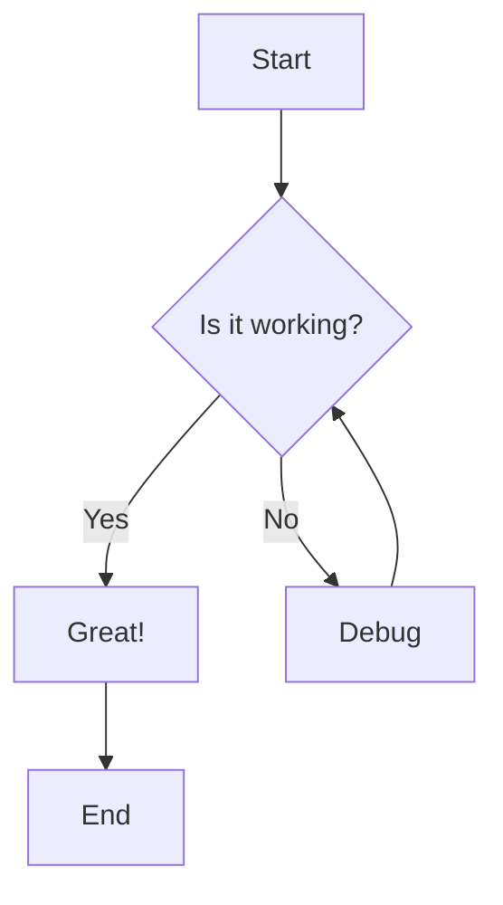
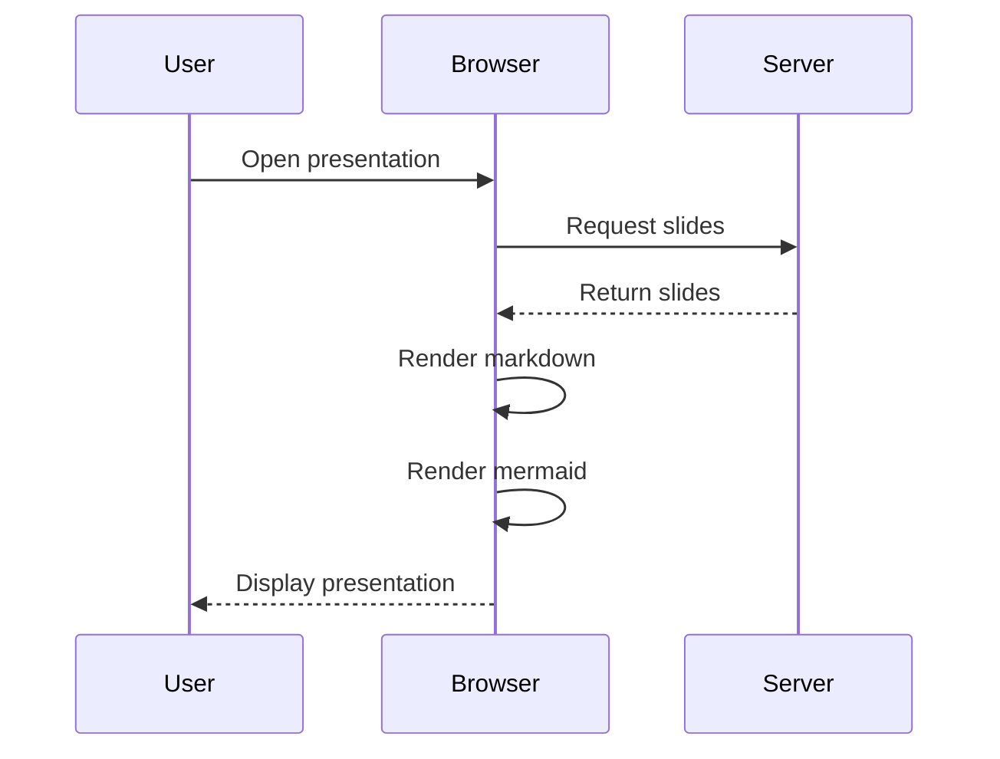
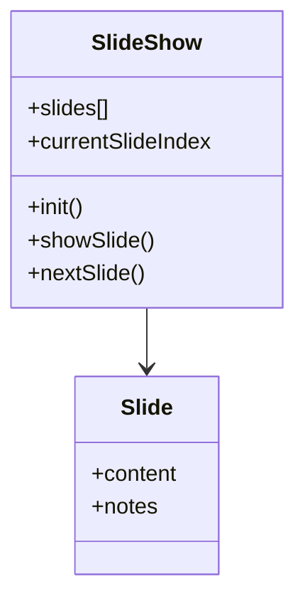
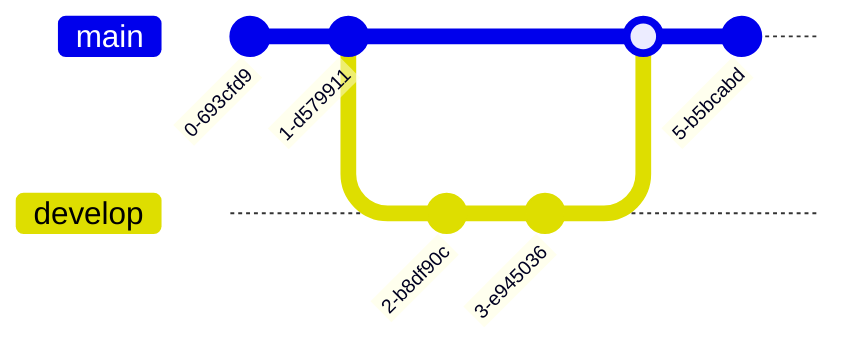
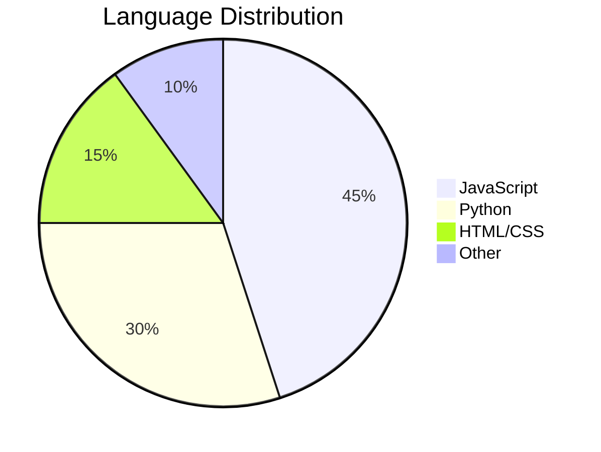
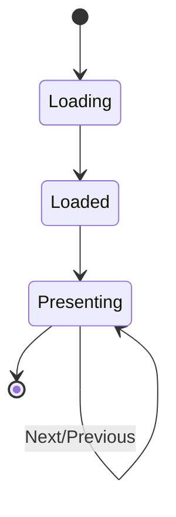

# Mermaid Diagram Test

Testing mermaid diagram support in MarkDeck

---

## Flowchart Example

---

## Sequence Diagram

---

## Class Diagram

---

## Git Graph

---

## Pie Chart

---

## State Diagram

---

# Success!

If you can see all the diagrams above, mermaid support is working correctly! 🎉
