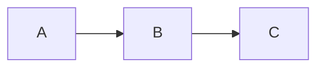

# MarkDeck Presentation Templates

Ready-to-use templates for common presentation types. Perfect for LLMs and humans alike!

## Available Templates

### 1. Simple Presentation (`simple-presentation.md`)

**Best for:**
- Quick presentations (5-10 slides)
- Basic talks
- Getting started quickly

**Structure:**
- Title slide
- Overview
- 3 topic slides
- Summary
- Thank you

**When to use:**
- You need something fast
- Simple message to communicate
- Short talks (5-15 minutes)

**How to use:**
```bash
cp examples/templates/simple-presentation.md my-talk.md
# Edit my-talk.md with your content
markdeck present my-talk.md --watch
```

---

### 2. Technical Talk (`technical-talk.md`)

**Best for:**
- Conference talks
- Technical deep-dives
- Architecture presentations
- Research presentations

**Includes:**
- Background & context
- Problem statement
- Solution architecture
- Implementation details
- Code examples
- Results & metrics
- Lessons learned
- Resources

**Features:**
- Speaker notes on key slides
- Two-column layouts for code
- Mermaid architecture diagrams
- Performance metrics tables
- Demo slide
- Case studies

**When to use:**
- 15-30 minute technical talks
- Conferences, meetups, tech talks
- Need to show code, architecture, results

**How to use:**
```bash
cp examples/templates/technical-talk.md my-technical-talk.md
# Customize with your content
markdeck present my-technical-talk.md --watch
```

---

### 3. Tutorial/Workshop (`tutorial-workshop.md`)

**Best for:**
- Workshops
- Training sessions
- Educational content
- Hands-on tutorials

**Includes:**
- Setup instructions
- Prerequisites check
- Multiple exercises
- Solution walkthroughs
- Best practices
- Debugging tips
- Resources & next steps

**Features:**
- Exercise slides with time estimates
- Starter code templates
- Step-by-step walkthroughs
- Common mistakes section
- Testing examples
- Extensive speaker notes
- Timeline/agenda with breaks

**When to use:**
- 30-90 minute workshops
- Training sessions
- Interactive learning
- Hands-on coding sessions

**How to use:**
```bash
cp examples/templates/tutorial-workshop.md my-workshop.md
# Add your specific content and exercises
markdeck present my-workshop.md --watch
```

---

### 4. Product Demo (`product-demo.md`)

**Best for:**
- Product launches
- Sales presentations
- Feature demos
- Pitch decks

**Includes:**
- Problem statement
- Product introduction
- Feature highlights
- Live demo section
- Customer testimonials
- Pricing tiers
- Call to action

**Features:**
- Before/after comparisons
- ROI calculations
- Customer case studies
- Pricing tables
- Integration examples
- Security & compliance
- Special offer slide

**When to use:**
- Product demonstrations
- Sales pitches
- Feature announcements
- Stakeholder presentations

**How to use:**
```bash
cp examples/templates/product-demo.md my-product-demo.md
# Customize with your product details
markdeck present my-product-demo.md --watch
```

---

## For LLMs: Template Selection Guide

When creating a presentation, choose a template based on:

### Use Case Matrix

| Goal | Duration | Audience | Recommended Template |
|------|----------|----------|---------------------|
| Quick update | 5-10 min | Any | Simple |
| Technical explanation | 15-30 min | Developers | Technical Talk |
| Teaching a skill | 30-90 min | Learners | Tutorial/Workshop |
| Selling/demoing | 15-30 min | Customers/Stakeholders | Product Demo |

### Decision Tree

```
Is it educational/training?
├─ Yes → Tutorial/Workshop
└─ No → Is it technical/deep-dive?
    ├─ Yes → Technical Talk
    └─ No → Is it product/sales focused?
        ├─ Yes → Product Demo
        └─ No → Simple Presentation
```

### Quick Prompts

**For Technical Talk:**
```
Use the technical-talk.md template to create a presentation about
[topic] for [audience]. Include code examples showing [feature],
architecture diagrams, and performance results.
```

**For Tutorial/Workshop:**
```
Use the tutorial-workshop.md template to create a [duration] workshop
teaching [skill/technology] to [audience level]. Include 2-3 hands-on
exercises with solutions.
```

**For Product Demo:**
```
Use the product-demo.md template to create a demo for [product]
highlighting features [X, Y, Z], customer results, and pricing tiers.
```

**For Simple:**
```
Use the simple-presentation.md template for a quick [duration]
presentation covering [3-5 main points].
```

---

## Customization Tips

### Removing Sections

Feel free to delete sections that don't apply:

```markdown
# Delete entire section by removing from --- to ---

---

## Section You Don't Need

Content here

---

# ← Delete up to here
```

### Adding Sections

Insert new slides between delimiters:

```markdown
---

## Existing Slide

---

## Your New Slide

New content here

---

## Next Existing Slide

---
```

### Combining Templates

You can mix and match sections from different templates:

```markdown
# Start with technical-talk.md structure
# Add hands-on exercise from tutorial-workshop.md
# Include customer results from product-demo.md
```

---

## Template Enhancement Guide

### Adding Speaker Notes

Add to any slide:

```markdown
## Your Slide

Content visible to audience

<!--NOTES:
- Additional context
- Talking points
- Timing estimates
- Transitions
-->
```

### Adding Two-Column Layouts

Replace single-column content with:

```markdown
:::columns
Left content

|||

Right content
:::
```

### Adding Diagrams

Replace text descriptions with Mermaid:

````markdown

````

### Adding Code Examples

Add language-specific code blocks:

````markdown
```python
# Your code here
def example():
    pass
```
````

---

## Best Practices for Template Usage

### DO:

- ✓ Start with a template closest to your needs
- ✓ Delete sections that don't apply
- ✓ Customize examples with your content
- ✓ Keep the overall structure
- ✓ Add speaker notes for complex slides
- ✓ Test your presentation before delivering

### DON'T:

- ✗ Feel obligated to use every slide
- ✗ Keep placeholder text
- ✗ Mix too many styles
- ✗ Overcomplicate simple messages
- ✗ Forget to update title and contact info

---

## Common Modifications

### Shorten a Presentation

1. Remove "Background" section
2. Combine related slides
3. Remove "Lessons Learned" section
4. Skip detailed case studies
5. Reduce number of examples

### Extend a Presentation

1. Add more examples per concept
2. Include additional case studies
3. Add intermediate summary slides
4. Include more exercises (for workshops)
5. Add "Related Topics" section
6. Include appendix slides

### Make it More Technical

1. Add more code examples
2. Include architecture diagrams
3. Add performance analysis
4. Include algorithm complexity
5. Add technical deep-dives

### Make it Less Technical

1. Replace code with pseudocode
2. Use more analogies
3. Add visual diagrams instead of code
4. Focus on benefits over implementation
5. Use simpler language

---

## Examples of Completed Presentations

See the main examples directory for full presentations:

- `examples/features.md` - Comprehensive feature showcase
- `examples/code-examples.md` - Syntax highlighting demo

These show how templates can be customized and extended.

---

## LLM Workflow for Using Templates

**Recommended workflow when an LLM creates a presentation:**

1. **Analyze the request**
   - What is the topic?
   - Who is the audience?
   - How long should it be?
   - What's the goal?

2. **Select template**
   - Use decision tree above
   - Choose closest match

3. **Customize structure**
   - Remove unnecessary sections
   - Add required sections
   - Adjust slide count for duration

4. **Fill in content**
   - Replace all placeholders
   - Add specific examples
   - Include relevant code/diagrams
   - Add speaker notes

5. **Verify completeness**
   - All placeholders removed?
   - Title and contact info updated?
   - Correct syntax?
   - Logical flow?

---

## Template Maintenance

These templates are living documents. Improvements welcome!

**To suggest changes:**
1. Identify what's missing or could be better
2. Propose specific improvements
3. Submit via issue or PR

**Version:** 1.0
**Last Updated:** 2024-01-04

---

## Quick Reference: All Templates

```bash
# List all templates
ls examples/templates/*.md

# Copy a template
cp examples/templates/[template-name].md my-presentation.md

# Present it
markdeck present my-presentation.md --watch
```

**Available templates:**
- `simple-presentation.md` - Quick & simple
- `technical-talk.md` - Technical deep-dive
- `tutorial-workshop.md` - Hands-on workshop
- `product-demo.md` - Product demonstration

Happy presenting! 🎬
