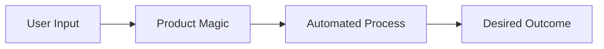
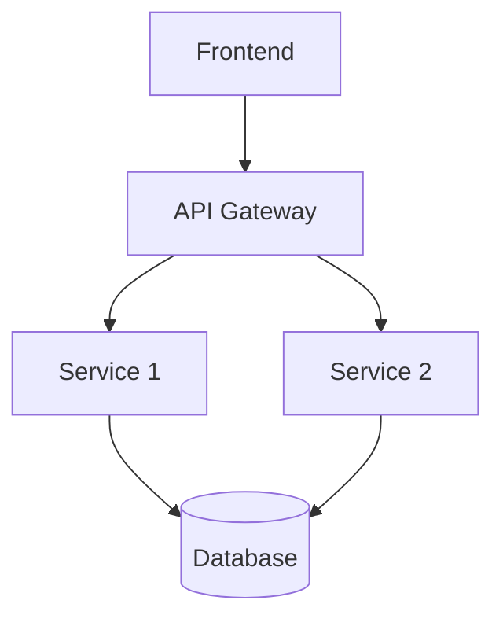

# [Product Name]

[Compelling Tagline]

[Presenter Name] | [Company] | [Date]

---

## The Problem

**Current Challenges:**
- Pain point 1
- Pain point 2
- Pain point 3

**Impact:**
- Cost impact
- Time impact
- Quality impact

> "Quote from frustrated user about the problem"

<!--NOTES:
- Make the pain relatable
- Use specific examples
- Reference statistics if available
-->

---

## The Cost of Inaction

:::columns
### Time Wasted

- Manual task 1: [X hours/week]
- Manual task 2: [X hours/week]
- Manual task 3: [X hours/week]

**Total:** [X hours/week]

|||

### Money Lost

- Lost productivity: $[amount]
- Error costs: $[amount]
- Opportunity cost: $[amount]

**Total:** $[amount/year]
:::

**Question:** Can you afford NOT to solve this?

---

## Introducing [Product Name]

**What is it?**
[One-sentence value proposition]

**How it helps:**
- Benefit 1
- Benefit 2
- Benefit 3

**The difference:**
[What makes your product unique]

---

## How It Works



**Simple 3-Step Process:**
1. **Input:** [What users provide]
2. **Process:** [What product does]
3. **Output:** [What users get]

---

## Key Features

### Feature 1: [Name]

**What it does:**
[Clear description]

**Why it matters:**
- Benefit 1
- Benefit 2

**Use case:** [Specific example]

---

## Feature 1: In Action

:::columns
### Setup

```code
# Simple configuration
config = {
    "feature": "enabled",
    "option": "value"
}

product.setup(config)
```

|||

### Result

**Immediate benefits:**
- Saves X hours
- Reduces errors by X%
- Improves Y by X%

**User feedback:**
> "Quote from happy user"
:::

---

## Feature 2: [Name]

**What it does:**
[Clear description]

**Why it matters:**
- Benefit 1
- Benefit 2

**Visual:**


---

## Feature 3: [Name]

**What it does:**
[Clear description]

**Comparison:**

| Task | Manual | With [Product] |
|------|--------|----------------|
| Time | 2 hours | 5 minutes |
| Errors | 10% | 0.1% |
| Cost | $100 | $5 |

**ROI:** [X]x improvement

---

## Live Demo

**What we'll show:**
1. Feature/workflow 1
2. Feature/workflow 2
3. Feature/workflow 3

[Keep slide minimal - focus on live demo]

<!--NOTES:
Demo Checklist:
- [ ] Environment ready
- [ ] Sample data loaded
- [ ] Backup plan if tech fails
- Key points to highlight
- Timing: 5-7 minutes
-->

---

## Real Customer Results

**Case Study: [Company Name]**

**Challenge:**
[What they were struggling with]

**Solution:**
[How they used your product]

**Results:**
- Metric 1: [X% improvement]
- Metric 2: [X% improvement]
- Metric 3: [X% improvement]

> "Testimonial quote from customer"
> — [Name, Title, Company]

---

## More Success Stories

:::columns
### Company A

**Industry:** [Industry]

**Results:**
- 50% faster
- 90% fewer errors
- $100K saved

|||

### Company B

**Industry:** [Industry]

**Results:**
- 10x productivity
- 95% automation
- 6-month ROI
:::

---

## Who Is It For?

**Perfect for:**

- ✓ [User persona 1]: [Their use case]
- ✓ [User persona 2]: [Their use case]
- ✓ [User persona 3]: [Their use case]

**Works with:**
- Existing tool/system 1
- Existing tool/system 2
- Existing tool/system 3

---

## Integration & Setup

**Getting Started:**

```bash
# Step 1: Install (1 minute)
npm install product-name
# or
pip install product-name

# Step 2: Configure (2 minutes)
product init

# Step 3: Use (immediately)
product run
```

**Time to value:** Under 5 minutes

---

## Pricing Plans

| Plan | Features | Price | Best For |
|------|----------|-------|----------|
| **Free** | Basic features | $0 | Individuals, Testing |
| **Pro** | Advanced features | $X/month | Small teams |
| **Business** | Full features | $X/month | Growing companies |
| **Enterprise** | Custom + Support | Contact us | Large organizations |

**All plans include:**
- Feature X
- Feature Y
- Feature Z

---

## Free vs Pro vs Enterprise

:::columns
### Free Tier

**Includes:**
- Feature 1
- Feature 2
- Feature 3

**Limits:**
- [Specific limit]

**Perfect for:** Testing, small projects

|||

### Pro Tier

**Everything in Free, plus:**
- Advanced feature 1
- Advanced feature 2
- Advanced feature 3

**Limits:**
- [Higher limits]

**Perfect for:** Production use
:::

---

## What Customers Say

> "This product saved us 20 hours per week. Absolutely worth it."
> — [Name, Title, Company]

> "Game changer for our team. We can't imagine working without it."
> — [Name, Title, Company]

> "ROI was clear within the first month. Highly recommended."
> — [Name, Title, Company]

**Average Rating:** ⭐⭐⭐⭐⭐ (4.9/5)

---

## Security & Compliance

**We take security seriously:**

- ✓ SOC 2 Type II certified
- ✓ GDPR compliant
- ✓ Enterprise SSO support
- ✓ Data encryption at rest and in transit
- ✓ Regular security audits
- ✓ 99.9% uptime SLA

**Your data is safe with us.**

---

## Roadmap

**Coming Soon:**
- Q1 2024: Feature A
- Q2 2024: Feature B
- Q3 2024: Feature C

**Your Voice Matters:**
- Feature requests: [link]
- User feedback: [link]
- Beta program: [link]

---

## Support & Resources

**Documentation:**
- Getting Started Guide
- API Documentation
- Video Tutorials
- Best Practices

**Community:**
- Community Forum
- Discord/Slack Channel
- Stack Overflow Tag

**Premium Support:**
- 24/7 chat support (Pro+)
- Dedicated account manager (Enterprise)
- Custom training (Enterprise)

---

## Comparison: Us vs Competitors

| Feature | Us | Competitor A | Competitor B |
|---------|-----|--------------|--------------|
| Price | $X | $X+50% | $X+80% |
| Setup Time | 5 min | 2 hours | 1 day |
| Integration | Native | API only | Manual |
| Support | 24/7 | Business hours | Email only |
| Free Tier | Yes | No | Limited |

**Why choose us:** Best value, fastest setup, superior support

---

## Common Questions

**Q: How long does setup take?**
A: Under 5 minutes for basic setup

**Q: Do you integrate with [Tool X]?**
A: Yes! We integrate with [list popular tools]

**Q: Can I cancel anytime?**
A: Yes, no long-term contracts

**Q: Is there a free trial?**
A: Yes, 14-day free trial, no credit card required

---

## Getting Started is Easy

**3 Simple Steps:**

1. **Sign up** at [website]
   - No credit card required
   - 14-day free trial

2. **Set up** in 5 minutes
   - Follow quick start guide
   - Or watch video tutorial

3. **Start saving time** immediately
   - See results on day 1
   - ROI within weeks

---

## Special Offer

**For attendees today:**

- ✨ 20% off first year
- ✨ Extended 30-day trial
- ✨ Free onboarding session
- ✨ Bonus feature access

**Use code:** [PROMO_CODE]

**Expires:** [Date]

---

## Take Action Now

**Option 1: Start Free Trial**
- No credit card
- Full features
- [Link/QR code]

**Option 2: Schedule Demo**
- Personalized walkthrough
- Q&A session
- [Link/QR code]

**Option 3: Contact Sales**
- Enterprise pricing
- Custom features
- [Email/Link]

---

## Key Takeaways

**Remember:**
- ✓ [Product] solves [problem]
- ✓ Save [X hours/dollars] per [time period]
- ✓ Used by [X] companies
- ✓ Setup in under 5 minutes
- ✓ Try free for 14 days

**ROI:** Most customers see ROI within [timeframe]

---

## Thank You!

**Questions?**

**Get Started:**
- Website: [url]
- Free Trial: [url]
- Contact: [email]

**Connect:**
- Twitter/X: [@handle]
- LinkedIn: [link]
- GitHub: [link]

**Special offer code:** [PROMO_CODE]

---

## Appendix: Technical Details

**For the technical folks:**

**Architecture:**


**Tech Stack:**
- Technology 1
- Technology 2
- Technology 3

<!--NOTES:
Only if technical questions come up
-->
