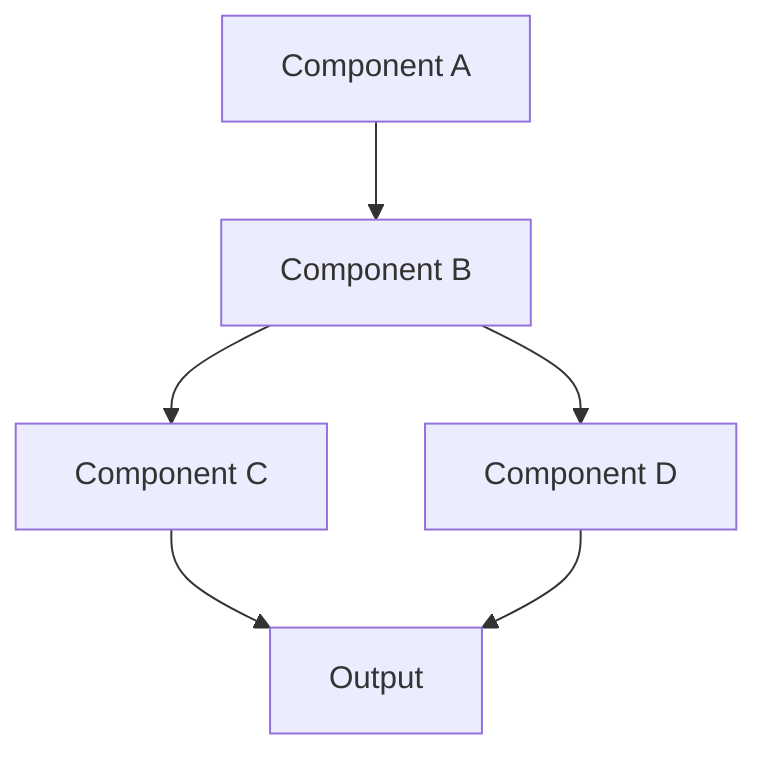
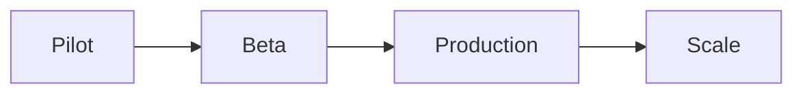

# [Your Talk Title]

[Your Name] | [Event/Conference] | [Date]

---

## Agenda

- Background & Context
- The Problem
- Our Solution
- Implementation Details
- Results & Impact
- Lessons Learned
- Q&A

---

## Background

**Context:**
- Background point 1
- Background point 2
- Background point 3

**Why This Matters:**
- Relevance to audience
- Impact on industry/field

<!--NOTES:
- Share personal story or motivation
- Connect with audience's experience
- Timing: 2 minutes
-->

---

## The Problem

:::columns
### Current Situation

- Challenge 1
- Challenge 2
- Challenge 3

|||

### Impact

**Effects:**
- Cost impact
- Time impact
- Quality impact

**Scale:** [statistics]
:::

<!--NOTES:
- Emphasize pain points
- Use specific examples
- Reference industry data
-->

---

## Existing Solutions

| Solution | Pros | Cons |
|----------|------|------|
| Approach A | Pro 1, Pro 2 | Con 1, Con 2 |
| Approach B | Pro 1, Pro 2 | Con 1, Con 2 |
| Approach C | Pro 1, Pro 2 | Con 1, Con 2 |

**Gap:** What's still missing?

---

## Our Solution

**Core Idea:**
[One-sentence description of your solution]

**Key Innovations:**
- Innovation 1: Brief description
- Innovation 2: Brief description
- Innovation 3: Brief description

---

## Architecture Overview



**Key Components:**
- Component A: Purpose and function
- Component B: Purpose and function
- Component C: Purpose and function

---

## Implementation: Core Algorithm

```python
def core_algorithm(data):
    """
    Main algorithm implementation.
    """
    # Step 1: Preprocessing
    processed = preprocess(data)

    # Step 2: Core logic
    result = apply_transformation(processed)

    # Step 3: Post-processing
    final = optimize(result)

    return final
```

**Key aspects:**
- Time complexity: $O(n \log n)$
- Space complexity: $O(n)$

---

## Implementation: Details

:::columns
### Code

```python
class Solution:
    def __init__(self, config):
        self.config = config
        self.cache = {}

    def process(self, input):
        if input in self.cache:
            return self.cache[input]

        result = self._compute(input)
        self.cache[input] = result
        return result
```

|||

### Explanation

**Design Decisions:**
- Caching for performance
- Configuration-driven
- Stateful processing

**Benefits:**
- 10x faster with cache
- Flexible configuration
- Memory efficient
:::

---

## Technical Challenges

1. **Challenge 1: [Name]**
   - Problem description
   - Solution approach
   - Result

2. **Challenge 2: [Name]**
   - Problem description
   - Solution approach
   - Result

<!--NOTES:
- Share specific technical details
- Discuss trade-offs
- Mention alternatives considered
-->

---

## Demo

**Live Demonstration**

Key features to show:
1. Feature/capability 1
2. Feature/capability 2
3. Feature/capability 3

[Keep this slide minimal - focus on live demo]

<!--NOTES:
- Demo script/checklist
- Fallback plan if demo fails
- Key points to highlight
- Timing: 5 minutes
-->

---

## Results: Performance

| Metric | Before | After | Improvement |
|--------|--------|-------|-------------|
| Speed | 1000ms | 100ms | 10x faster |
| Memory | 500MB | 50MB | 90% less |
| Throughput | 10/sec | 100/sec | 10x more |
| Error Rate | 5% | 0.5% | 90% reduction |

**Overall:** [Summary of improvements]

---

## Results: Real-World Impact

**Case Study: [Company/Project Name]**

- **Problem:** [Original issue]
- **Solution:** [How they used it]
- **Results:** [Specific outcomes]

> "Quote from user/stakeholder about impact"
> — [Name, Title]

---

## Adoption & Rollout



**Timeline:**
- Month 1: Pilot with 10 users
- Month 2: Beta with 100 users
- Month 3: Production rollout
- Month 4+: Scaling to 1000+ users

---

## Lessons Learned

**What Worked Well:**
- ✓ Success 1
- ✓ Success 2
- ✓ Success 3

**What We'd Do Differently:**
- Improvement area 1
- Improvement area 2

**Key Insight:** [Main takeaway]

---

## Future Work

**Next Steps:**
- Enhancement 1
- Enhancement 2
- Enhancement 3

**Long-term Vision:**
- Where this is heading
- Potential applications
- Research directions

---

## Key Takeaways

**Remember These Points:**
1. ✓ Key insight 1
2. ✓ Key insight 2
3. ✓ Key insight 3

**Action Items:**
- What audience can do next
- Where to learn more
- How to get involved

---

## Resources

**Code & Documentation:**
- GitHub: [repository link]
- Docs: [documentation link]

**Learn More:**
- Paper: [link if applicable]
- Blog post: [link]
- Tutorial: [link]

**Contact:**
- Email: [your email]
- Twitter/X: [@handle]

---

## Thank You!

**Questions?**

[Your Name]
[Your Email/Contact]
[GitHub/Website]

Slides available at: [link]
