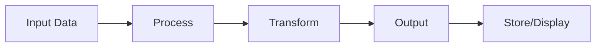
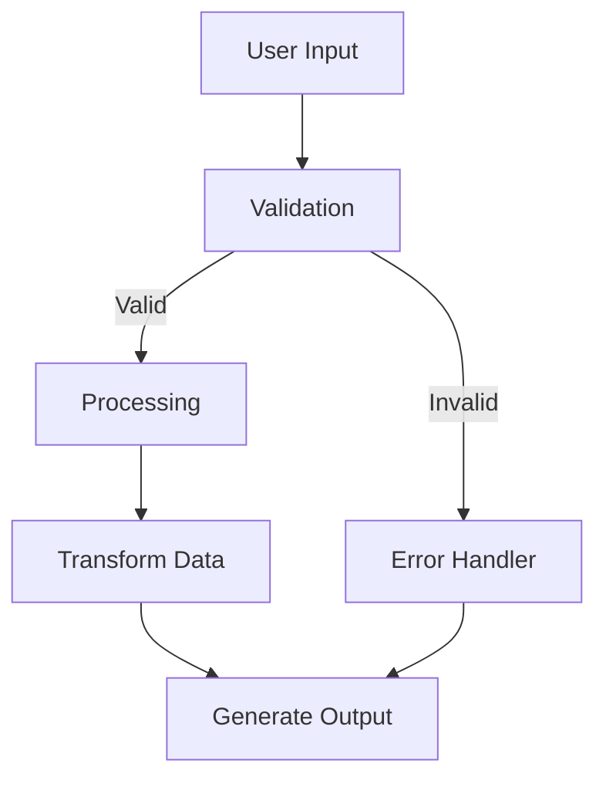

# [Tutorial Title]

Learn [Technology/Skill] in [Duration]

[Instructor Name] | [Date]

---

## Welcome!

**What You'll Learn:**
- Skill/Topic 1
- Skill/Topic 2
- Skill/Topic 3

**By the End:**
You'll be able to [concrete outcome]

---

## Agenda

**Timeline:**
- 0:00 - Introduction & Setup (10 min)
- 0:10 - Fundamentals (20 min)
- 0:30 - Hands-on Exercise 1 (15 min)
- 0:45 - Advanced Concepts (20 min)
- 1:05 - Hands-on Exercise 2 (20 min)
- 1:25 - Best Practices (15 min)
- 1:40 - Q&A & Resources (10 min)

<!--NOTES:
- Start on time
- Keep to schedule
- Breaks at 0:45 and 1:25
-->

---

## Prerequisites

**You Should Know:**
- Prerequisite 1 (basic level)
- Prerequisite 2 (basic level)

**You Should Have:**
- Software/Tool 1 installed
- Software/Tool 2 installed
- Account on Platform X (optional)

**Don't Worry If:**
- You're new to [specific topic]
- You haven't used [tool] before

---

## Setup Instructions

**Quick Setup (5 minutes):**

```bash
# 1. Install the tool
curl -sSL https://example.com/install.sh | sh

# 2. Verify installation
toolname --version

# 3. Create a new project
toolname init my-project
cd my-project
```

**Verify it works:**
```bash
toolname run
# Should output: "Hello, World!"
```

<!--NOTES:
- Walk around and help with setup
- Have USB drives with installers ready
- Common issues: PATH, permissions
-->

---

## What is [Technology]?

**Definition:**
[One-sentence definition]

**Why Use It:**
- Benefit 1
- Benefit 2
- Benefit 3

**When to Use It:**
- Use case 1
- Use case 2
- Use case 3

---

## Key Concepts

:::columns
### Concept 1

**[Name]:** Brief definition

Example:
```
Simple example here
```

|||

### Concept 2

**[Name]:** Brief definition

Example:
```
Simple example here
```
:::

**These are the building blocks** - we'll use them throughout the tutorial

---

## Fundamentals: Basic Syntax

```language
# Your first program
def hello_world():
    print("Hello, World!")

hello_world()
```

**Breaking it down:**
- Line 1: Comment for clarity
- Line 2: Function definition
- Line 3: Function body (indented)
- Line 5: Function call

**Try it:** Run this code in your environment

<!--NOTES:
- Have participants run this
- Check for errors
- Explain any questions
- Timing: 3 minutes
-->

---

## Fundamentals: Variables & Data Types

:::columns
### Code Example

```language
# Variables
name = "Alice"
age = 30
height = 5.6
is_student = False

# Collections
numbers = [1, 2, 3, 4, 5]
person = {
    "name": name,
    "age": age
}
```

|||

### Explanation

**Basic Types:**
- String: `"text"`
- Integer: `42`
- Float: `3.14`
- Boolean: `True/False`

**Collections:**
- List: `[item1, item2]`
- Dictionary: `{key: value}`
:::

---

## Fundamentals: Control Flow

```language
# If statement
if age >= 18:
    print("Adult")
else:
    print("Minor")

# Loop through list
for number in numbers:
    print(number)

# While loop
count = 0
while count < 5:
    print(count)
    count += 1
```

**Practice:** Modify these examples and see what happens

---

## Common Patterns

**Pattern 1: [Name]**
```language
# When to use: [scenario]
code example here
```

**Pattern 2: [Name]**
```language
# When to use: [scenario]
code example here
```

---

## 🛠️ Exercise 1: [Name]

**Goal:** Build a [simple program/feature]

**Requirements:**
1. Must do X
2. Should handle Y
3. Output should be Z

**Steps:**
1. Create a new file `exercise1.ext`
2. Implement [specific function]
3. Test with provided inputs
4. Expected output: [example]

**Time:** 10-15 minutes

<!--NOTES:
- Share starter code repository link
- Solution available in solutions/exercise1.ext
- Common mistakes to watch for
- Help those who finish early with bonus challenge
-->

---

## Exercise 1: Starter Code

```language
# exercise1.ext - Starter template

def solve_problem(input):
    """
    TODO: Implement your solution here

    Args:
        input: [description]

    Returns:
        [description]
    """
    pass  # Replace with your code


# Test cases
test_inputs = [1, 2, 3]
for input in test_inputs:
    result = solve_problem(input)
    print(f"Input: {input}, Output: {result}")
```

**Bonus Challenge:** Handle edge case [description]

---

## Exercise 1: Solution Review

```language
# Possible solution
def solve_problem(input):
    """
    Solution explanation
    """
    # Step 1: Process input
    processed = process(input)

    # Step 2: Apply logic
    result = compute(processed)

    return result
```

**Key Points:**
- Why this approach works
- Alternative approaches
- Common mistakes to avoid

<!--NOTES:
- Show 2-3 different solutions
- Discuss trade-offs
- Praise creative approaches
-->

---

## Advanced Concept 1: [Name]

**What is it:**
[Clear explanation]

**Why it matters:**
- Reason 1
- Reason 2

**Simple Example:**
```language
# Before (basic approach)
basic code here

# After (using advanced concept)
improved code here
```

---

## Advanced Concept 2: [Name]

:::columns
### Implementation

```language
class AdvancedFeature:
    def __init__(self):
        self.state = {}

    def method1(self, arg):
        # Implementation
        pass

    def method2(self, arg):
        # Implementation
        pass
```

|||

### When to Use

**Use cases:**
- Scenario 1
- Scenario 2

**Benefits:**
- Benefit 1
- Benefit 2

**Trade-offs:**
- Consider X vs Y
:::

---

## Real-World Application



**Example Scenario:**
[Describe a real-world use case]

**How it works:**
1. Input: [description]
2. Processing: [description]
3. Output: [description]

---

## 🛠️ Exercise 2: [Name]

**Goal:** Build a more complex [application/feature]

**Requirements:**
1. Use advanced concept from previous slides
2. Implement features A, B, and C
3. Handle errors gracefully
4. Include tests

**Steps:**
1. Fork starter repository
2. Implement [Component 1]
3. Implement [Component 2]
4. Add error handling
5. Test your solution

**Time:** 15-20 minutes

<!--NOTES:
- More challenging than Exercise 1
- Encourage pair programming
- Solutions branch available
- Bonus features for advanced users
-->

---

## Exercise 2: Architecture



**Components to implement:**
- Input validation
- Core processing logic
- Error handling
- Output formatting

---

## Exercise 2: Tips & Hints

**Hints:**
1. Start with the validation function
2. Use the pattern from earlier slides
3. Don't forget edge cases
4. Test incrementally

**Common Pitfalls:**
- ❌ Forgetting to handle empty input
- ❌ Not validating data types
- ❌ Assuming perfect inputs

**Resources:**
- Documentation: [link]
- Helper functions: See `utils.ext`

---

## Exercise 2: Solution Walkthrough

```language
# Step-by-step solution
class Solution:
    def __init__(self):
        self.validator = Validator()
        self.processor = Processor()

    def run(self, input):
        # 1. Validate
        if not self.validator.is_valid(input):
            return self.handle_error(input)

        # 2. Process
        processed = self.processor.process(input)

        # 3. Return result
        return self.format_output(processed)
```

**Discussion:** What other approaches could work?

---

## Best Practices

**DO:**
- ✓ Write clear, descriptive names
- ✓ Comment complex logic
- ✓ Handle errors gracefully
- ✓ Test your code
- ✓ Keep functions small and focused

**DON'T:**
- ✗ Hard-code values
- ✗ Ignore error cases
- ✗ Write overly complex code
- ✗ Skip documentation
- ✗ Optimize prematurely

---

## Code Style & Conventions

```language
# Good: Clear and readable
def calculate_average(numbers):
    """Calculate the average of a list of numbers."""
    if not numbers:
        return 0
    return sum(numbers) / len(numbers)


# Bad: Unclear and cryptic
def ca(n):
    return sum(n)/len(n) if n else 0
```

**Follow the style guide:** [Link to language style guide]

---

## Testing Your Code

```language
# Simple tests
def test_calculate_average():
    # Test normal case
    assert calculate_average([1, 2, 3]) == 2

    # Test edge cases
    assert calculate_average([]) == 0
    assert calculate_average([5]) == 5

    # Test negative numbers
    assert calculate_average([-1, 1]) == 0

    print("All tests passed!")

test_calculate_average()
```

**Testing Tips:**
- Test normal cases
- Test edge cases
- Test error cases

---

## Debugging Techniques

**When something goes wrong:**

1. **Read the error message** - It tells you what and where
2. **Use print statements** - See what values are
3. **Check assumptions** - Verify your expectations
4. **Simplify** - Remove complexity until it works
5. **Search** - Google/Stack Overflow the error

**Common Errors:**
- Syntax errors: Typos, missing brackets
- Type errors: Wrong data type
- Logic errors: Code runs but wrong result

---

## Common Mistakes & Solutions

| Mistake | Symptom | Solution |
|---------|---------|----------|
| Off-by-one error | Wrong count/index | Check loop bounds |
| Null/None value | Crash on access | Add null check |
| Wrong scope | Variable not found | Check indentation |
| Infinite loop | Program hangs | Add loop exit condition |

**Pro Tip:** Use a debugger to step through code

---

## Performance Tips

**Make it work, then make it fast:**

1. **First:** Write correct code
2. **Then:** Measure performance
3. **Finally:** Optimize bottlenecks

**Common Optimizations:**
- Use appropriate data structures
- Avoid nested loops when possible
- Cache expensive computations
- Use built-in functions (they're optimized)

**Example:**
```language
# Slow: O(n²)
# [slow code]

# Fast: O(n)
# [optimized code]
```

---

## Going Further

**Next Steps:**
1. Build a small project using what you learned
2. Read [recommended book/resource]
3. Join [community/forum]
4. Contribute to [open source project]

**Project Ideas:**
- Idea 1: [description]
- Idea 2: [description]
- Idea 3: [description]

---

## Resources

**Documentation:**
- Official Docs: [link]
- Tutorial: [link]
- API Reference: [link]

**Learning:**
- Online Course: [link]
- Book: [title and link]
- Video Series: [link]

**Community:**
- Forum: [link]
- Discord/Slack: [link]
- Stack Overflow Tag: [tag]

---

## Today's Code

**All code from today:**
- Repository: [github link]
- Slides: [slides link]
- Exercises: [exercises link]
- Solutions: [solutions link]

**Branches:**
- `main` - Starter code
- `solutions` - Complete solutions
- `bonus` - Extra challenges

---

## Key Takeaways

**Remember:**
1. ✓ [Main concept 1]
2. ✓ [Main concept 2]
3. ✓ [Main concept 3]

**Practice makes perfect:**
- Build something small every day
- Don't be afraid to break things
- Learn from errors

**You've got this!** 🚀

---

## Thank You!

**Questions?**

**Stay in touch:**
- Email: [your email]
- Twitter/X: [@handle]
- GitHub: [username]
- Website: [url]

**Feedback:** [survey link]

---

## Bonus Slide: Advanced Topics

**For those interested:**

- Advanced Topic 1: [brief description]
- Advanced Topic 2: [brief description]
- Advanced Topic 3: [brief description]

**Resources for deeper learning:**
- [Advanced resource 1]
- [Advanced resource 2]

<!--NOTES:
Only if time permits or for Q&A
-->
